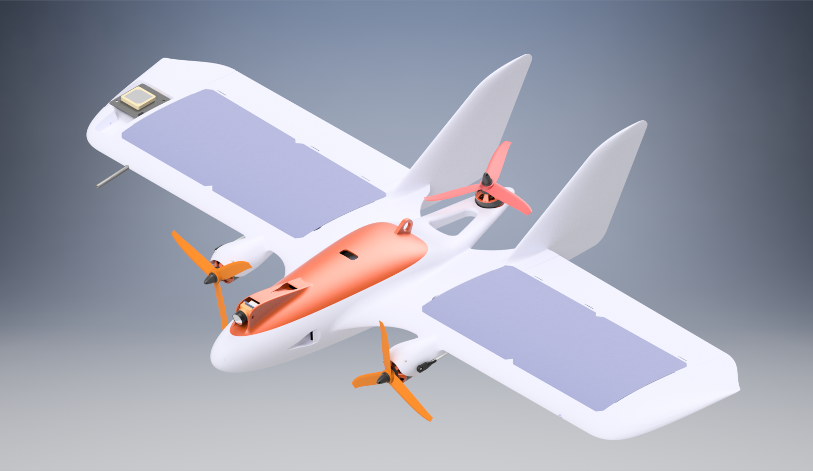

# MiniHawk-VTOL <a name="head-brief"></a>
The MiniHawk VTOL is a 3D-Printed Tricopter/Fixed-wing hybrid aircraft, capable of Vertical Take-off and Landing. As with its predecessor, the [OrangeHawk VTOL](https://diydrones.com/profiles/blogs/the-orange-hawk-tricopter-flying-wing-vtol-uav), the MiniHawk is intended for R/C, FPV and UAV experimentation.  Mechanical artwork, build instructions, and configuration settings are provided in this repository.  

**Milestones**
| Date | Event |
|------|-------|
| 25 Sept | Pre-release |

Betaflight VTOL Firmware Build: [vtol-motor-mix](https://github.com/StephenCarlson/betaflight/tree/vtol-motor-mix)  

Accompanying Build Video Series: [YouTube Playlist](https://www.youtube.com/playlist?list=PLEMjH2uELUcYI_DS1zthgjE4Su79LeA_G)  

# Table of Contents
1. [Introduction](#head-brief)  
  1.1 [Description](#head-description)  
  1.2 [Remarks / FAQs](#head-faqs)  
  1.3 [Metrics](#head-metrics)  
2. [Build Information](#build-brief)  
  2.1 [Recommended Tools](#build-tools)  
  2.2 [Components and Electronics](#build-components)  
  2.3 [Airframe Parts Listing](#build-airframeparts)  
3. [Build Steps](#buildseq-brief)  
  3.1 [Part 1 - Airframe Structures](#buildseq-part1)  
  3.2 [Part 2 - Linkages and Servos](#buildseq-part2)  
  3.3 [Part 3 - Electronics and Finishing](#buildseq-part3)  
4. [Flight Testing](#flight-brief)  
5. [3D Printing Guidelines](#3dprinting-brief)  
6. [Betaflight](#betaflight-brief)  
  6.1 [R/C Controls Configuration](#betaflight-controlsconfig)  
  6.2 [Flight Controller Connections](#betaflight-connections)  
  6.3 [CLI Parameters](#betaflight-cli)  
  6.4 [Remarks](#betaflight-remarks)  
7. [License](#license-brief)  

## Description <a name="head-description"></a>
The MiniHawk is a 3D-Printed VTOL aircraft. It was designed with printability in mind, and is intended to provide the community with a common and accessible VTOL testbed for experimentation and tinkering. The vehicle uses three (3) brushless DC motors for propulsion, with the forward pair tilting for forward flight and yaw control, and the rear motor fixed for hover only. Four (4) servos are used to tilt the forward motors and to control the elevon control surfaces of the wing. The airframe is a "plank"-style wing with a center body containing avionics and battery, and internal conduits routing to the nacelles and servos. Twin vertical stabilizer fins provide mild directional stability.  

## Remarks / FAQs <a name="head-faqs"></a>
- As this is a totally 3D-printed airframe, the fully-finished vehicle is moderately heavy, which is a handicap, especially in the hovering mode of flight. As such, be gentle and cautious in adding any additional weight. For the recommended print settings with a 0.4mm nozzle, the airframe alone weights a bit over 300g, and the all-up-weight of the finished vehicle is between 700g and 800g.  
- The parts used in this project are commonly available in the drone racing and R/C plane market(s). The only known limiting component is the DYS BE1806 motor, which is an older (~2015 era) motor with a diameter of 23mm and around 80W power. A standard 22xx- or 23xx-sized motor can be used on the tail, but the nacelle design was modeled specifically for the DYS BE1806-2300KV. A future revision may increase the nacelle size to be able to mount 22xx-sized motors. Another potentially limiting component is the GreatPlanes GPMQ3843 Threaded Ball-Link set.  
- The aerodynamics and stability of the vehicle are still under analysis and subject to revision. The CFD poses/cases used for aerodynamics analysis are included for independent study.  
- Most project files are prefixed with "MH5", as this is the 5th internal revision of the design of the MiniHawk VTOL. The "MH#" prefix is incidental and not to be confused with the MH airfoil series, of which the MH45 is used for this vehicle. Generally, "MiniHawk VTOL" is the correct name for this design and any revisions to be released.
- This vehicle was designed in Autodesk Inventor Professional 2019. While compiled STLs are provided, the Solid Model and Assembly files for this vehicle are withheld at the time of this writing; contact me for inquires on obtaining a copy or further development.  
- The Rear Strakes are recent additions to the design to compensate for poor directional stability. The aircraft does not weathervane into the relative wind well without them, and may yet require even larger vertical stabilization surfaces, not unlike the early days of the F-117 stealth aircraft. Another late addition to the design is the Lid FPV Variant, which supports the Foxeer -Nano camera formfactor (15mm width) and has a 30.5mm grid for a video transmitter, such as the AKK Infinite DVR.  

## Metrics <a name="head-metrics"></a>
| Description              | Value                     |
|--------------------------|---------------------------|
| Wing Span                | 800mm                     |
| Wing Area                | 15.6dm^2                  |
| Aspect Ratio             | 4.1                       |
| Airfoil (Root and Tip)   | [MH45][1]                 |
| Length                   | 396mm                     |
| Rotor Spacing            | 315mm Circle              |
| Lipoly Battery           | 3s to 4s, 1300mAh         |
| Motors (front)           | DYS BE1806 2300kV or eqv. |
| Motor (rear)             | 22xx or 23xx ~2000kV      |
| Servos                   | HS-65HB/MG or eqv.        |
| Flight Controller (size) | 30.50mm to 16.0mm Grid    |
| Propellers (front)       | 5050 to ~5249             |
| Propeller (rear)         | 6030 to ~5249             |

[1]: <https://www.mh-aerotools.de/airfoils/mh45koo.htm> "MH45 Airfoil by Martin Hepperle"

# MiniHawk Build Parts List and Tools: <a name="build-brief"></a>
## Recommended Tools and Equipment <a name="build-tools"></a>
 - FDM/FFF 3D Printer with build volume greater than 23.1x210.7x330.0mm (Dimensions of largest part, which is Left/Right Wing. Adventurous builders might try printing on smaller printers by sectioning larger parts.)
 - Soldering Station and associated tools and materials
 - Handcrafting Tools
 - Adhesives: Cyanoacrylate Glue, Epoxy, Hot-Melt Adhesive Gun, Tape

## Components and Electronics: <a name="build-components"></a>
| Qty | Item Description                                     | Notes                                              |
|-----|------------------------------------------------------|----------------------------------------------------|
| 1   | Flight Controller (3 Motor, 4 Servo Outputs)         | Recommend: Matek Systems F722-WING                 |
| 1   | R/C Receiver, 8+ Channel, SBUS or PPM Output         |                                                    |
| 3   | ESC (3s, 20A or better)                              |                                                    |
| 2   | **DYS BE1806 2300KV BLDC Motor**                     | (Note 1)                                           |
| 1   | 22xx 2000KV BLDC Motor                               | (Note 2)                                           |
| 1   | 3s1300 Lipoly (40C or better)                        |                                                    |
| 1   | XT60 Pigtail or equiv.                               |                                                    |
| 2   | HS-65HB Servo (or equiv.)                            | Elevon Servos, see (Note 3).                       |
| 2   | HS-65MG Servo (or equiv.)                            | Motor Tilt Servos, see (Note 4).                   |
| 6   | (opt) Du-Bro SKU#118 Small Nylon Hinge               | Elevon Reinforcement, see (Note 5).                |
| -   | M2 or M3 Mounting Hardware (Nuts, Bolts, Standoffs)  | For mounting Flight Controller, trays.             |
| 4   | 6-Inch Servo Extension Cable                         | (Note 6)                                           |
| 1   | Male-to-Male Servo Extension Cable                   | Flight Controller to Receiver PPM/SBUS connection. |
| 4   | 2-56 Link Clevis (Note 7)                            | Four (4) servo arm connections.                    |
| 2   | 2-56 Threaded Linkage Rod, Length>=52mm              | Elevon pushrods, L-bend at 45mm from threaded tip. |
| 2   | (opt) Du-Bro SKU#855 E/Z Links 0.72 (2-56) Clip      | For securing L-Bends, can replace with Z-bend.     |
| 2   | 1/16-inch 2-56 Ball Link and Coupler Pair            | **GreatPlanes GPMQ3843**, see (Note 8).            |
| 2   | 2-56 Fully-Threaded Rod, Length=60mm                 | End1=(Link 2-56 Clevis), End2=(2-56 Ball Coupler)  |
| 2   | 2-56 Smooth Rod, Length=24mm                         | (Note 9)                                           |
| 2   | (opt) WS2812 5050 SMD (or equiv. Addressable LED)    | Soldered with magnet wire, mounted in wingtips.    |
| -   | M4 and M5 Prop Nuts                                  | Replace default prop nuts if needed                |
| 1   | 50xx Propeller, Clockwise Rotation                   | Left/Port-side Propeller, 5-inch                   |
| 1   | 50xx Propeller, Counterclockwise Rotation            | Right/Starboard-side Propeller, 5-inch             |
| 1   | 50xx or 60xx Propeller, Counterclockwise Rotation    | Tail Propeller, 5- or 6-inch                       |
| 1   | Velcro Battery Strap                                 |                                                    |
| 1   | (opt) Battery Voltage Monitor / Alarm Buzzer         | For Flight Controller if not included.             |

> Note 1: Front motors must be no larger than OutsideDiameter=23mm, able to produce between 350g to 500g static thrust (@full-throttle), and pitch speed of ~20m/s (@half-throttle) with 5-inch prop.  
> Note 2: Tail motor may be up to OutsideDiameter=30mm, able to produce between 700g to 1000g static thrust (@full-throttle) with up to a 6-inch prop.  
> Note 3: Servo bays are designed for up to 26mm wide servos, 17.5mm from bottom of mounting tabs to bottom of servo, 32mm from top of output shaft to bottom of servo, 12mm thick. Should fit most "Sub-Micro" Servos.  
> Note 4: Same pocket dimensions as above, but these are going to be fantastically abused and must be fairly tough. Or just count on stripping your non-metal-gear servos a lot.  
> Note 5: Can be omitted, but 3D-printed living-hinge on elevons will eventually fail, mend appropriately. SKU#118 is 6 per package, SKU#119 for 15/pkg.  
> Note 6: Alternatively, cut the servo cables and solder in-line extensions for the cables to reach to the flight controller, plus some slack.  
> Note 7: The clevises and rods can be purchased as a set, such as Du-Bro SKU#185, which is a set of 5 rods with clevises already attached.  
> Note 8: **CRITICAL!!!** The Ball Link thread must be "116", 1/16-inch, 62.5mil, or 1.59mm. The more popular variant of this type of part has a 2-56 thread size ball, which is too big for the nacelle motor tilt attachment. Note that this is the ball-link thread size; the coupler that captures the ball is 2-56 threaded. This ball-link set attaches from the motor tilt servo linkage to the motor tilt mount, which holds the front left/right motor.  
> Note 9: Diameter=[1.83mm to 1.87mm], formed from spare pieces of 2-56 Servo Pushrod. Use non-threaded smooth rod, roughen/knurl only one end slightly for press-fitting to nacelle.  

## Airframe Parts: <a name="build-airframeparts"></a>
| Part                     | Source File                                                                        |
|--------------------------|------------------------------------------------------------------------------------|
| Fuselage Nose            | [MH5_Nose.stl](/stl-SourceFiles/MH5_Nose.stl)                                      |
| Empennage Left Half      | [MH5_Empennage.stl](/stl-SourceFiles/MH5_Empennage.stl)                            |
| Empennage Right Half     | [MH5_Empennage.stl](/stl-SourceFiles/MH5_Empennage.stl) *Mirrored*                 |
| Lid Left Half            | [MH5_Lid.stl](/stl-SourceFiles/MH5_Lid.stl)                                        |
| Lid Right Half           | [MH5_Lid.stl](/stl-SourceFiles/MH5_Lid.stl) *Mirrored*                             |
| Fin (2)                  | [MH5_FinLeft.stl](/stl-SourceFiles/MH5_FinLeft.stl)                                |
| Rear Strake (2)          | [MH5_RearStrake.stl](/stl-SourceFiles/MH5_RearStrake.stl)                          |
| Left Wing                | [MH5_WingLeft.stl](/stl-SourceFiles/MH5_WingLeft.stl)                              |
| Right Wing               | [MH5_WingLeft.stl](/stl-SourceFiles/MH5_WingLeft.stl) *Mirrored*                   |
| Elevon Control Horn (2)  | [MH5_ControlHorn.stl](/stl-SourceFiles/MH5_ControlHorn.stl)                        |
| Left Nacelle Left Half   | [MH5_NacelleB.stl](/stl-SourceFiles/MH5_NacelleB.stl)                              |
| Left Nacelle Right Half  | [MH5_NacelleA.stl](/stl-SourceFiles/MH5_NacelleA.stl)                              |
| Left Motor Mount         | [MH5_TiltMount.stl](/stl-SourceFiles/MH5_TiltMount.stl)                            |
| Right Nacelle Left Half  | [MH5_NacelleA.stl](/stl-SourceFiles/MH5_NacelleA.stl) *Mirrored*                   |
| Right Nacelle Right Half | [MH5_NacelleB.stl](/stl-SourceFiles/MH5_NacelleB.stl) *Mirrored*                   |
| Right Motor Mount        | [MH5_TiltMount.stl](/stl-SourceFiles/MH5_TiltMount.stl) *Mirrored*                 |
| Flight Controller Tray   | [MH5_ControllerTray.stl](/stl-SourceFiles/MH5_ControllerTray.stl)                  |
| Battery Tray             | [MH5_BatteryTray.stl](/stl-SourceFiles/MH5_BatteryTray.stl)                        |

# Build Sequence <a name="buildseq-brief"></a>
The following instructions assume that a full set of airframe parts have been printed, as enumerated above.

[Figure-1]: </doc-Documentation/Figure-1.png> "Figure 1 - Hinge Pin Clearance"
[Figure-2]: </doc-Documentation/Figure-2.png> "Figure 2 - Elevon Movement Cuts"
[Figure-3]: </doc-Documentation/Figure-3.png> "Figure 3 - Hatch/Lid Bonding"
[Figure-4]: </doc-Documentation/Figure-4.png> "Figure 4 - Empennage Halves Bonding"
[Figure-5]: </doc-Documentation/Figure-5.png> "Figure 5 - Elevon Control Horn Install"
[Figure-6]: </doc-Documentation/Figure-6.png> "Figure 6 - Empennage/Tail Attachment"
[Figure-7]: </doc-Documentation/Figure-7.png> "Figure 7 - Nacelle Halves Bonding"
[Figure-8]: </doc-Documentation/Figure-8.png> "Figure 8 - Wing Attachment"
[Figure-9]: </doc-Documentation/Figure-9.png> "Figure 9 - Nacelle Pocket Finishing"
[Figure-10]: </doc-Documentation/Figure-10.png> "Figure 10 - Shaft and Bolt Hole Reaming"
[Figure-11]: </doc-Documentation/Figure-11.png> "Figure 11 - Nacelle Attachment"
[Figure-12]: </doc-Documentation/Figure-12.png> "Figure 12 - Vertical Stabilizer Attachment"
[Figure-13]: </doc-Documentation/Figure-13.png> "Figure 13 - Strake Attachment"
[Figure-14]: </doc-Documentation/Figure-14.png> "Figure 14 - Linkages and Movements"
[Figure-15]: </doc-Documentation/Figure-15.png> "Figure 15 - Propeller Rotation Directions"
[Figure-16]: </doc-Documentation/Figure-16.png> "Figure 16 - Center of Mass"

## Part 1 - Airframe Structures and Motor Mount/Tilt Attachment <a name="buildseq-part1"></a>
1. Clean all 3D-Printed parts, remove all brim/support material. For each wing, carefully carve away any stringing or over-extrusion in the hinge reinforcement wells such that the hinge pin will fit. [Figure-1] Carefully cut the elevons free if needed (**WARNING!** Only cut slots on either end to allow for surface deflection, DO NOT cut the entire elevon out), and gently exercise each surface up and down until the living hinge is established. [Figure-2] Bond the Canopy/Hatch-Lid pieces together using Thin/Medium Cyanoacrylate or Epoxy, and set aside to cure. [Figure-3]
2. Bond the Empennage Halves together. Thin or Medium Cyanoacrylate, or Epoxy, are acceptable. Set aside to cure. [Figure-4]
3. Bond the Control Horn pieces (2) into each Elevon (Left Wing and Right Wing). Thin or Medium Cyanoacrylate, or Epoxy, are acceptable. The Control Horn should be fairly flush on the Elevon Top Surface, approximately 0.5mm extending above the surface. Fit should be tight; carefully carve away any burrs or over-extrusion from the slot in the elevon if needed. [Figure-5]
4. Glue the Du-Bro Nylon Mini-Hinge pieces (3 per wing, Du-Bro SKU#118) into the recesses along each elevon hinge. Hot-Melt-Adhesive, CA, or Epoxy should work.
5. Lightly sand the bonded empennage/tail interface surface until smooth and planar/flush. Test-fit to the Fuselage/Nose to confirm a proper flush joint, and then bond to the Fuselage/Nose using Thin or Medium Cyanoacrylate, or Epoxy. Set aside to cure. [Figure-6]
6. Bond the Nacelle Pair Halves together. Thin or Medium Cyanoacrylate, or Epoxy, are acceptable. Proper alignment is critical, be careful and precise. Set aside to cure. [Figure-7]
7. Lightly sand both wing root interface surfaces on the completed fuselage/body until flush and smooth. Test-fit both wings to each respective surface to confirm a proper flush joint. Bond either the left or right wing to the fuselage (not recommended to attach both at once) using Epoxy. (Cyanoacrylate may not have the strength needed.) Set aside to cure. When the first wing is cured, bond the second wing and set aside to cure. [Figure-8]
8. Test-fit each Motor Mount (Tilt Mount/Pod) with its respective completed nacelle. Sand or trim as needed such that the Motor Mount is able to tilt fully flush forward, and able to tilt up past 90 degrees of rotation. [Figure-9]
9. For each Nacelle with its respective Motor Mount aligned and present, Ream (Drill to size) using a 1.58mm (1/16 Inch, 62.5mil) drill bit. (Should be 85% to 90% of diameter of hinge rod to be fitted. Hinge Rod diameter is 1.84mm or 72mil for this case.) Keep the Motor Mount and Nacelle together. Adapt a section of hinge rod to be used as a final precision reaming tool by sharpening the tip using a grinder or emery wheel. Use this improvised reaming tool to ream the hole in each nacelle-mount pair to the final diameter of 1.84mm (72mil). [Figure-10]
10. Remove each Motor Mount from its respective Nacelle and ream only the Motor Mount hole to the next higher drill bit size, not to exceed 107% of diameter of the the hinge rod. Too large will allow for excessive play and possible rattling; too small will result in binding. 1.95mm (77mil, 5/64 Inch) is acceptable for hinge rod diameter of 1.84mm.
11. Cut the hinge rod pieces, not to exceed 24mm length. Roughen/knurl one or both ends if desired. Press-fit each hinge rod to each Nacelle through the respective Motor Mount. Verify that each Motor Mount can rotate freely and with minimal play in the hinge.
12. For each Motor Mount, ream the Motor Mount linkage mount hole to 1.19mm (3/64 Inch, 47mil). This should be about 80% of the major diameter of the threaded ball link to be mounted. (Great Planes Threaded Ball Link Set 1/16", GPMQ3843; ball-link is 1.50mm major diameter.) Mount the threaded ball-link to the linkage mount hole. The Motor Mount can sustain up to 3.3mm threaded bolt depth, verify that the bolt does not extend too far into the well, such that it will not make contact with the motor.
13. Bond each Nacelle to its respective wing; note that the ball-link should align with the respective servo linkage slot/well. Epoxy is recommended, as this is a significant load-bearing structure. Verify alignment and tweak/tune while the glue cures. [Figure-11]
14. Bond both vertical fins to the wing(s). [Figure-12] Medium Cyanoacrylate should be sufficient. Bond the Rear Strakes to the bottom of the wing(s) and bottom edge of the vertical fins. [Figure-13]

## Part 2 - Linkages and Component Mounting <a name="buildseq-part2"></a>
1. Mount the front two motors in their respective Motor Mounts. The motor leads may have heatshrink that may interfere or bind the wires; rework this if needed. Mount the motors using the M2 threaded bolt kit that should be included with each motor. Be careful not to have any mounting bolt over-extend into the motor armature/stator. Verify that each motor turns freely and is well secured. Route the wires through the wing and into the main bay, and test the extension-retraction behavior of the wires as the motor mount pitches between forward and hover tilt positions. For each motor, attach the propeller hub hardware kit that should be included with each, such that it can drive a standard 5-Inch propeller.
2. The Rear motor should mount to the tail using M3 threaded bolts that were included with the motor. Route the motors wires through either wire duct channel to the main bay as desired. Verify that the motor rotates freely and is well secured. Attach the propeller hub hardware kit that should be included with the motor, such that it can drive a standard 5-Inch propeller.
3. The Motor Mount Tilt servos should be tested and centered on a standard RC PWM signal, visiting 1000us, 1500us, and 2000us pulse-widths. Attach a servo arm with a 19.3mm (0.76 Inch) hole-to-center spacing. This value is critical, as the linkage behavior of the tilting front motor mounts cannot be easily modified and any length short of this will result in the motor tilt not reaching the needed angle for hover and anti-torque (yaw) control. An arm any longer than this will not fit in the linkage well/slot. With whatever arm fitted as similar to 19.3mm as possible, test fit the servo into the servo well and verify that between 1000us and 2000us pulse widths, the arm comfortably retracts into the well/slot, and fully sweeps about 90 to 95 degrees from that point. Verify the best servo arm spline position and bolt/secure the arm in place. [Figure-14]
4. For each of the Elevon servos, repeat the same procedure as above, but with a servo arm approximately 9.5mm hole-to-center (3/8 Inch). This length can be a bit longer or shorter, the effect is increasing or decreasing elevon control throw. For servos that have an odd-number spline tooth count (such as the Hitec HS-65HB's B1 spline with 25 teeth), to get the most well-centered and symmetric solution, center the servo on a 1500us pulse width and alternate attaching a 4-arm output horn between each 90-degree position to find the most orthogonal/centered position, and then cut off the 3 unneeded arms.
5. Verify that the Link Clevises that attach to the servo arms are able to couple and rotate freely. Reaming each servo arm may be necessary, a value of 1.59mm (1/16 Inch, 62mil) is common.
6. Route the servo wires through the conduit tunnels in the wing to the main bay. Be advised that this is somewhat irreversible, depending on the quality of the 3D print, any glue protrusions in the tunnel, and weaving/tangling of the pigtails after routing. The pins in the 3-pin header on the pigtail can be carefully removed to allow the wires to pass back out if needed later. Assuming all servos have a 6-inch (~150mm) pigtail, the Elevon servos will have some slack, but the Tilt servos will arrive just barely at the main bay. Servo Extensions can be added, or the servo pigtail can be extended with a section of 3-wire servo lead/cable, or the 3-pin servo connectors can be discarded in favor of direct soldering later if desired.
7. With servo harnessing finished in one form or another, bond the servos to the airframe using Hot-Melt-Adhesive. Note that the airframe may exhibit deformation or melting at the bonding locations, depending on print material used. Verify that the servos can produce full torque without becoming detached from the airframe. Also note that alternatives may be explored in servo mounting, such as double-sided adhesive tape, but it is not advised to use cyanoacrylate or epoxy.
8. Form the elevon control rods by creating an L-bend 45mm from the threaded tip of the pair of 2-56 link rods used. Test fit the retaining Du-Bro E/Z Links 0.72 (2-56) Retainer Clip for each bend, and modify the bend as needed and cut flush. Alternatively, a traditional Z-bend can be formed to dismiss the Retain Clips as a requirement. For each Elevon, attach its control rod to the elevon control horn, and attach the clevis to the corresponding servo arm. Detach, turn the clevis, and reattach as needed until the elevon is flush while the servo is centered on 1500us.
9. Cut two (2) 60mm long pieces from a fully-threaded 2-56 rod to form the tilt control rod pair. (DO NOT L-bend or Z-bend these rods.) Soften the cut ends with a grinder or emery wheel such that they will easily thread into the Nylon Ball-Link couplers. Thread on the ball-link couplers and link clevises, and attach each to its respective servo arm or ball-link head. Detach-turn-reattach as needed, such at the servo approaches as close to top-dead-centre (arm retracted into well/slot) as possible, without binding or interference, while the tilting motor mount is firmly forward and pressed against the nacelle. As noted earlier, the clevis should attach to the highest hole in the servo arm, at 19.3mm arm distance. It may be required to bend this rod slightly to allow for the servo arm to fully retract without the clevis impacting the arm. If the servo is straining excessively when the motor mount is retracted, adjust accordingly. **WARNING!** If the servo is allowed to strain with the clevis binding against the servo arm, the servo will likely fail via burnt-out H-bridge driver or motor.
10. The above steps assumed that the servos were powered and commanded during final installation, but for completeness, this step verifies that the servos are able to actuate, and are not being stressed. For each servo, visit 1000us-1500us-2000us and observe deflection on Elevons or Motor Mount and verify that there is no excessive binding or stress. For each motor mount, simulate the load exhibited during forward flight by gently pulling on the motor in the forward direction (about 300 grams force), while the servo is actively commanded to retain the forward condition, and verify that the motor is retained/held in the forward flight position with minimal creepage. Elevons should actuate the full range with light loading on the control surface.

## Part 3 - Electronics and Final Configuration <a name="buildseq-part3"></a>
1. Solder the Flight Controller as desired. This usually means soldering pin headers to attach the 3-pin servo connectors from the servos and ESCs. Solder a battery connection lead (XT60 or as desired). Power the Flight Controller and verify that it is booting and communicating correctly. Default (likely multicopter) firmware will be fine for the next few steps; be advised that servos **SHOULD NOT** be connected to the flight controller until the flight controller outputs are configured.
2. Bond the Battery and Flight Controller Trays into the main bay. This can be accomplished using M2 or M3 hardware and ample Hot-Melt-Adhesive and some reaming if necessary. The Battery Tray can be permanently mounted, but retain some ability to remove the Flight Controller Tray, as mounting/removing the flight controller requires access to the bottom of that tray. 
3. Solder the BLDC Motor leads to each respective ESC, or use bullet-connectors or otherwise as desired. Solder the ESC power connections directly to the Flight Controller's Power-Distribution region, or to intermediate connections as desired. Power on the Flight Controller carefully, such as with a "Smoke Stopper" or a current-limited power supply, and verify that the power system is wired correctly. Program the ESCs for proper rotation direction: Port/Left Motor is Clockwise (CW), Starboard/Right Motor is Counterclockwise (CCW). (If using a BLHeli Passthru mode to program ESCs, the ESCs may be connected to any output(s) on the flight controller.) The Rear Motor may technically be either direction, but I **strongly** recommend Counterclockwise (CCW) to allow for most non-multicopter propeller options (most propellers are CCW), and to force a consistent tradition that allows for future sharing of PID profiles and control schemes symmetrically. [Figure-15]
 > A brief note on prop rotation directions: The reason for the front motors having the Clockwise and Counterclockwise directions as stated is such that when the vehicle is flying in forward flight, and then immediately commanded to hover, the advancing blade(s) are placed as far abeam (toward the wingtip) as possible, while the retreating blade is closer to the main body. This should allow for better roll control through the transition, and by placing the effective centeres of lift for each rotor slightly wider in this condition, any PID control effort is more likely to remain bounded and slightly attenuated by the slightly longer moment-arm. This also follows the typical configuration for quadrotors, which also have the front advancing blades placed on the outside of the arc.
4. At this point, configure the Flight Controller with any specific firmware or settings relevant to controlling a Tricopter VTOL Fixed-Wing vehicle, if not already. Attach the servo and ESC headers to their required pins. Install the R/C receiver and connect to the Flight Controller as required. Mount the Flight Controller to its tray, and secure the tray inside the main bay. Power the vehicle and verify Flight Controller orientation is correct, servos are properly commanded, and that control surface efforts are in the correct direction. Reverse and trim servo outputs as necessary in the Flight Controller configurator.
> Note for the Matek F722-WING: Configuration and assignments are documented in *Betaflight Settings* below.
5. (Optional) WS2812 LEDs may be mounted in each wingtip, provided each is a SMD5050 or smaller package, with wires directly soldered to the package pads, and then mounted in the light well on each tip.
6. Stow the ESCs to the side-walls of the main bay using tape or double-sided adhesive pads. Stow any excess wires, and generally clean up the inside of the main bay. Secure the battery using Velcro straps, Tape, or other measures.
7. Mount the propellers to their respective motors. For initial flight testing, it is recommended to use the same propeller for all three motors, a 5030 to 5040 three-blade prop is recommended. Later on, the rear propeller may be swapped with a 5535 or 6030 three-blade, and the front two may be swapped with a 5050 or similar.
8. The Center-of-Mass for the aircraft is intended to be at 165mm back from the tip of the nose, or 40mm back from the leading edge of the wing. This is exactly along the middle pair of mounting holes for the Battery Tray. This is an initial value, and the Center-of-Mass may be shifted back by around 8mm to 10mm from this point, but with increasing risk to stability. As this vehicle is both a fixed-wing and multicopter, the Center-of-Mass stated here is for the fixed-wing condition, and any measurement of Center-of-Mass should be performed with the motors tilted into the forward-flight condition, propellers attached, and the lid secured. Shift the battery fore or aft to achieve proper balance, or add ballast if merited. [Figure-16]
9. Perform any other measures necessary to get the vehicle ready for flight. Decals, paint, or heat-activated covering are possibilities. Vehicle mass should come to an All-Up-Weight around 700 grams to 800 grams, with the 3D-printed airframe alone measuring around 300 grams.

# Flight Testing (In Progress) <a name="flight-brief"></a>
1. Discovering PIDs; test-stand setup and axis-isolation. Gain Scheduling for hover-to-forward-flight and reverse transitions.
2. Free hovering hops, progressing to static hovering, tuning hovering PIDs.
3. Forward-flight transitions with direct R/C control (no PIDs altering control surfaces)
4. PIDs for Forward flight pitch and roll. 
> The vehicle is designed to hover with a nose-high attitude (positive Angle-of-Attack). The reason for this is so that as the nose is dropped to level, the thrust vector brings the vehicle to an initial forward drift. Having established a forward trajectory, the motors are tilted to the 50/50 intermediate point and the vehicle is allowed to accelerate. The motors are then dropped to full forward-flight position.

# 3D Printing Guidelines <a name="3dprinting-brief"></a>
Unlike other 3D-printed R/C aircraft, the MiniHawk does not have any internal structures explicitly specified, such as ribs or stringers; only the outer-mold-line of the aircraft and the bays, wiring conduits, and mounting points are defined. The internal structure is yielded to whatever infill pattern is selected in the slicing software used to convert the volume definition for 3D-Printing. The internal structures may be explicitly defined in a future revision, but otherwise it is up to the builder to define the infill pattern used. The following sections provide recommended settings for each airframe part set (matching the settings in the 3MF files).

| Parameter                 | MH5_WingLeft and MH5_WingRight | MH5_Nose                | MH5_EmpennageSet        | MH5_LidPair             | MH5_NacelleSet            | MH5_TiltMountPair         |
|---------------------------|--------------------------------|-------------------------|-------------------------|-------------------------|---------------------------|---------------------------|
| LayerHeight               | 0.2mm                          | 0.2mm                   | 0.2mm                   | 0.2mm                   | 0.2mm                     | 0.2mm                     |
| WallThickness             | 0.4mm                          | 0.4mm                   | 0.4mm                   | 0.4mm                   | 0.8mm                     | 0.8mm                     |
| TopThickness              | 0.2mm                          | 0.2mm                   | 0.2mm                   | 0.2mm                   | 0.6mm                     | 0.6mm                     |
| BottomThickness           | 0.2mm                          | 0.2mm                   | 0.2mm                   | 0.2mm                   | 0.6mm                     | 0.6mm                     |
| TopBottomMainPattern      | Lines                          | Concentric              | Lines                   | Lines                   | Lines                     | Lines                     |
| InitialBottomLayerPattern | Concentric                     | Concentric              | Concentric              | Concentric              | Lines                     | Lines                     |
| FillGapsBetweenWalls      | Nowhere                        | Nowhere                 | Nowhere                 | Nowhere                 | Everywhere                | Everywhere                |
| Z-SeamAlignment           | UserSpecified (Note 1)         | SharpestCorner,HideSeam | SharpestCorner,HideSeam | SharpestCorner,HideSeam | SharpestCorner,ExposeSeam | SharpestCorner,ExposeSeam |
| InfillDensity             | 5.00%                          | 10.00%                  | 10.00%                  | 10.00%                  | 20.00%                    | 30.00%                    |
| InfillPattern             | Cubic                          | Cubic                   | Cubic                   | Cubic                   | Cubic                     | Cubic                     |
| InfillLineDirections      | 90deg                          | 0deg                    | 0deg (Note 2)           | 90deg                   | 0deg                      | 0deg                      |
| GenerateSupport           | Nowhere                        | Nowhere                 | Nowhere                 | Nowhere                 | Yes                       | Nowhere                   |
| SupportPlacement          |                                |                         |                         |                         | TouchingBuildPlate        |                           |
| SupportOverhangAngle      |                                |                         |                         |                         | 70deg                     |                           |
> Note 1: Forced to occur on trailing edge of wing.  
> Note 2: Is slightly offset in X-direction for best structure.  

For the MH5_ControlHornSet and MH5_TraySet, print 100% Solid or as desired. These pieces may be laser-cut if possible.


# Betaflight Settings (For Matek F722-Wing) <a name="betaflight-brief"></a>

## R/C Controller Configuration (Mode 2 Controller) <a name="betaflight-controlsconfig"></a>
| R/C Channel | Description         | 1000us         | 1500us     | 2000us                  | Notes                                                          |
|-------------|---------------------|----------------|------------|-------------------------|----------------------------------------------------------------|
| CH 1        | Roll                | Roll Left      | Centered   | Roll Right              |                                                                |
| CH 2        | Pitch               | Nose Up        | Neutral    | Nose Down               |                                                                |
| CH 3        | Throttle/Collective | Idle           | 50% Thrust | 100% Thrust             | Using Stick Arming, Low+Right to ARM                           |
| CH 4        | Rudder              | Yaw Left       | Neutral    | Yaw Right               |                                                                |
| CH 5        | VTOL Condition      | Forward-Flight | 50/50      | Hover                   | 3-Position Switch, use Slow-Up/Slow-Dn to slow sweep-rate      |
| CH 6        | Self-Level, F/S     | Disabled       | LEVEL Mode | LEVEL Mode, FAILSAFE    | LEVEL Mode @ 1500us, Receiver lost-link failsafe set to 2000us |
| CH 7        | Elevon PID          | Disabled       | ---        | ACTIVE                  | Elevons participate in stabilization, direct control otherwise |
| CH 8        | Forward-Flight Trim | Nose-Up Trim   | Neutral    | Nose-Down Trim          | Analog Potentiometer Knob                                      |

The analog potentiometer used for Forward-Flight Trim is necessary, as the trim setting for hover on the R/C controller may not coincide with the most comfortable forward-flight pitch trim condition. Use the trim switches/sliders on the R/C controller pitch-axis to trim when hovering, and use the knob when in forward-flight.

## Flight Controller Connections <a name="betaflight-connections"></a>
| Pin # | Control Endpoint    |
|-------|---------------------|
| S1    | Left Elevon Servo   |
| S2    | Right Elevon Servo  |
| S3    | Right Tilt Servo    |
| S4    | Left Tilt Servo     |
| S5    | Rear/Tail Motor ESC |
| S6    | NO CONNECTION       |
| S7    | Left Motor ESC      |
| S8    | Right Motor ESC     |

## Betaflight CLI <a name="betaflight-cli"></a>
Select the appropiate CLI listing in `/cfg-Config/` to run on the flight controller prior to powering up with any motors or servos attached. **WARNING!** Modern ESC protocols (such as OneShot or DShot) do not play well with servos if accidentally connected. At best, the servo will filter out the packet, but in some cases the servo will burn out.

MATEK F722-WING: [BTFL_cli_MiniHawk_MatekF722WING.txt](/cfg-Config/BTFL_cli_MiniHawk_MatekF722WING.txt)

Some selected lines that should be fairly consistent across all hardware:
```bash
# feature
feature MOTOR_STOP

# mixer
mixer CUSTOMAIRPLANE
mmix 0  1.000  1.000 -0.667  0.000
mmix 1  1.000 -1.000 -0.667  0.000
mmix 2  1.000  0.000  1.333  0.000

# servo mixer
smix 0 4 2 -10 0 0 100 2
smix 1 5 2 -10 0 0 100 2
smix 2 4 2 -50 0 0 100 3
smix 3 5 2 -50 0 0 100 3
smix 4 4 8 100 1 0 83 0
smix 5 5 8 -100 1 17 100 0
smix 6 2 4 50 0 0 100 0
smix 7 3 4 50 0 0 100 0
smix 8 2 5 50 0 0 100 0
smix 9 3 5 -50 0 0 100 0
smix 10 2 0 20 0 0 100 1
smix 11 3 0 20 0 0 100 1
smix 12 2 1 20 0 0 100 1
smix 13 3 1 -20 0 0 100 1
smix 14 2 11 50 0 0 100 0
smix 15 3 11 -50 0 0 100 0

# vmix
vmix 0 4  1.000  0.000  0.390  0.720  0.940  1.000
vmix 1 4  1.000  0.000  0.390  0.720  0.940  1.000
vmix 2 4  0.000  0.000  0.390  0.720  0.940  1.000

# aux
aux 0 1 1 1400 2100 0 0
aux 1 27 1 1800 2100 0 0
aux 2 13 1 1800 2100 0 0
aux 3 23 2 1600 2100 0 0
aux 4 24 0 1325 1675 0 0
aux 5 25 0 1675 2100 0 0
aux 6 28 2 1600 2100 0 0

# rxfail
rxfail 4 s 2000
rxfail 5 h
rxfail 6 s 2000

# master
set min_throttle = 1000
set dshot_idle_value = 0
set motor_pwm_protocol = DSHOT600
set motor_pwm_rate = 16000
set failsafe_off_delay = 100
set failsafe_throttle = 1300
set failsafe_procedure = AUTO-LAND
set beeper_dshot_beacon_tone = 3
set debug_mode = GYRO_SCALED
set enable_stick_arming = ON
set name = MiniHawk

profile 0

# profile 0
set pid_at_min_throttle = OFF
set p_pitch = 40
set i_pitch = 30
set d_pitch = 20
set f_pitch = 0
set p_roll = 120
set i_roll = 60
set d_roll = 10
set f_roll = 0
set p_yaw = 60
set i_yaw = 5
set f_yaw = 0
set angle_level_strength = 30
set horizon_level_strength = 30
set d_min_roll = 0
set d_min_pitch = 0

```

Some Details and Explanations for the above lines: 
- `smix` lines 0 through 3 define the yaw effort contributed to the Motor Tilt Servos, which are on servo slot indexes 4 and 5. The mode flags `SERVO2` and `SERVO3`, which are defined in the `aux` section, form three conditions, such that yaw effort is 50% weight at hover, 10% weight at the 50/50 condition, and no yaw effort at forward-flight. This is honestly a hack until a more preformant/complete VTOL mixer is implemented with servos included; for now only the motors are attenuated by the `vmix`5-point scheduling function.
- `smix` lines 4 and 5 are the contribution from the VTOL condition channel; this sets the tilt angle of the motors between hover, 50/50, and forward-flight. The endpoints are tweaked such that the motors only tilt to 83% or 17% of the driving condition channel when in hover, allowing for some slack for yaw differential tilt, and setting the front rotors to "level" with the rear rotor forward cant angle.
- `smix` lines 6 through 9 are the elevon mixing function; servo slots 2 and 3 are mixed with the R/C Roll and Pitch inputs (indexed as 4 and 5 in the murky depths of Betaflight).
- `smix` lines 10 through 13 are the contributions of the PID control loop to the elevons. This is switched on and off by the `SERVO1` mode flag. Note that the elevons ought to have their own PID controller with dedicated coefficients, but for now, the same PIDs used for hovering are reused here, but with enough attenuation (20% weight in this case) that the control effort should be very underdamped and bounded.
- `smix` lines 14 and 15 are the forward-flight pitch trim input, as a way to separate the hover trim state from the flying-wing pitch trim.
- `vmix` subject to change, but for the moment is `vmix <motor_index> <rc_channel_index> <throttle_passthru> <pt1> <pt2> <pt3> <pt4> <pt5>`. `rc_channel_index` is 4, corresponding to the VTOL condition channel, and the front motors (0 and 1) inherit the untampered raw R/C Throttle value after attenuation by the VTOL Mixer, but the rear motor (2) is purely attenuated such that it is idling in the forward-flight condition. Points 1 through 5 are the attenuation curve, where `pt1` is the attenuation coefficient at the minimum input from the controlling channel, and `pt5` is the highest. The values {0.000, 0.390, 0.720, 0.940, 1.000} approximate the sine function.  


## Remarks: <a name="betaflight-remarks"></a>
Betaflight is used in this project is for its ability to adjust resource mapping, such that motors and servos are aligned into separate timer domains. The sister-project to Betaflight, iNavFlight, does not offer the equivalent mechanism to redefining motor and servo outputs, such that, for the Matek F722-WING as an example, it is impossible to have three (3) motor outputs and four (4) servo outputs active; the iNavFlight defaults only allow for up to two motor outputs with servos. So while iNavFlight offers the same smix and mmix functionality as Betaflight, it is not immediately targeted. Otherwise, iNavFlight would be selected as the flight control firmware for this vehicle, as it is focused on fixed-wing vehicles and autonomy.
 
Despite Betaflight having critical mechanisms for this vehicle, it still requires modification. The version of Betaflight at the time of this writing, [4.2.0](https://github.com/betaflight/betaflight/releases/tag/4.2.0), does not have PID Gain Scheduling or any means to switch between PID profiles in-flight, though it has been requested such as in [#2452](https://github.com/betaflight/betaflight/issues/2452) and [#8507](https://github.com/betaflight/betaflight/issues/8507). (Note that iNavFlight also has many VTOL-related requests such as [#5920](https://github.com/iNavFlight/inav/issues/5920), [#3087](https://github.com/iNavFlight/inav/issues/3087), [#5607](https://github.com/iNavFlight/inav/issues/5607), and [#5050](https://github.com/iNavFlight/inav/issues/5050).) Therefore, my own fork of the Betaflight firmware under the branch [vtol-motor-mix](https://github.com/StephenCarlson/betaflight/tree/vtol-motor-mix) is developed toward implementing the necessary adjustments for VTOL flight. This is the origin of the `vmix` configuration parameters in the above CLI listing.

Betaflight's `smix` is fairly complex. The [Betaflight Mixer](https://github.com/betaflight/betaflight/blob/master/docs/Mixer.md) uses "slots" to assign servo outputs, and since slots 0 and 1 are allocated for gimbal, the actual starting index is slot 2. Hence, the usage of slots 2, 3, 4 and 5 for the elevon and tilt servos. As of this writing, the `<speed>` term seems to be inoperative, but otherwise the attempt to slow the nacelles is made, as given by the `1` in `smix 4 4 8 100 1 0 83 0`. Slowed nacelle tilt is implemented in the R/C Controller for the time being.  

The Resource allocation in the F722-Wing has been shifted here to allow for the three (3) motors and four (4) servos to reside in separated timer domains. Typing `timer show` in the Betaflight CLI should show the servos all grouped into the `TIM3` domain, the front motor pair in `TIM4`, and the rear/tail motor in `TIM2`. By rearranging the resource listing like this, the firmware will later automatically sort/map the outputs such that the servos are on pins S1 through S4, and the Motors on S5, S7 and S8. S6 cannot be used as a servo output as it is captured in the `TIM2` domain. (This limitation may be able to be overcome if the motor protocol is set to a non-digital one such as OneShot125, which would allow servo and ESC PWM generation to exist on the same timer domain, but this is at the mercy of the specifics of Betaflight and flight controller hardware.)  

The PIDs listed above have proven to be stable in hover testing. In the CLI Configuration file(s), I've commented-out lines that may not be relevant, such as accelerometer calibration and RX_PPM, make your own adjustments as needed. Blackbox debugging is set to `2kHz` and `GYRO_SCALED` in the GUI, which may emit entries under *master*. I've been using [Plasmatree](https://github.com/Plasmatree/PID-Analyzer) for tuning and finding vibration noise in the sensory path.  

# License <a name="license-brief"></a>
This work is licensed under the Creative Commons Attribution-NonCommercial-ShareAlike 4.0 International License. To view a copy of this license, visit http://creativecommons.org/licenses/by-nc-sa/4.0/ or send a letter to Creative Commons, PO Box 1866, Mountain View, CA 94042, USA.  

The software configuration text files provided here likely fall under the same license as Betaflight, GPL-3.0 at the time of this writing.  
